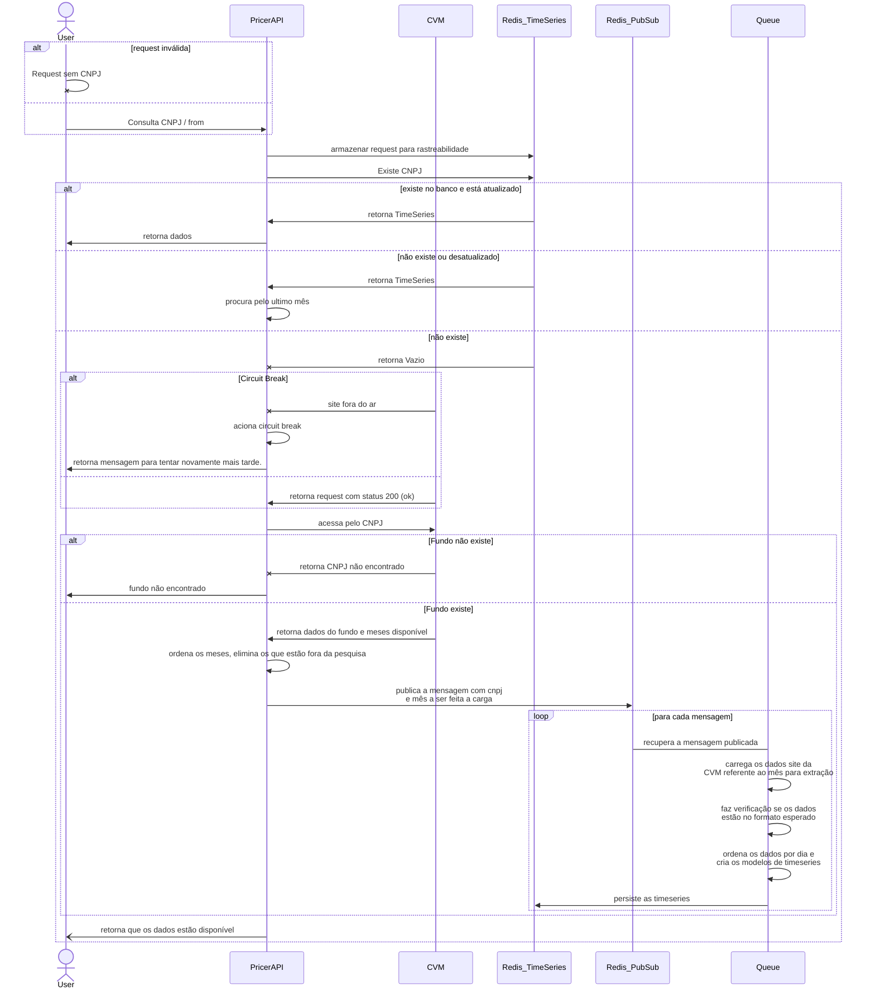

```mermaid
sequenceDiagram
	actor User
	participant api as PricerAPI
	participant cvm as CVM
	participant db as Redis_TimeSeries
	participant queue as Redis_PubSub
	participant td as Queue
	
	alt request inválida
		User -x User: Request sem CNPJ
	else
		User ->> api: Consulta CNPJ / from
	end
	api ->> db: armazenar request para rastreabilidade
	api ->> db: Existe CNPJ
	alt existe no banco e está atualizado
		db ->> api: retorna TimeSeries
		api ->> User: retorna dados
	else não existe ou desatualizado
		db ->> api: retorna TimeSeries
		api ->> api: procura pelo ultimo mês
	else não existe
		db -x api: retorna Vazio

		alt Circuit Break
			cvm -x api: site fora do ar
			api ->> api: aciona circuit break
			api ->> User: retorna mensagem para tentar novamente mais tarde.
		else
			cvm ->> api: retorna request com status 200 (ok)
		end
		
		api ->> cvm: acessa pelo CNPJ
		
		alt Fundo não existe
			cvm -x api: retorna CNPJ não encontrado
			api ->> User: fundo não encontrado
		else Fundo existe
			cvm ->> api: retorna dados do fundo e meses disponível
			api ->> api: ordena os meses, elimina os que estão fora da pesquisa
			api ->> queue: publica a mensagem com cnpj <br>e mês a ser feita a carga
			loop para cada mensagem
				queue -> td: recupera a mensagem publicada
				td ->> td: carrega os dados site da <br>CVM referente ao mês para extração
				td ->> td: faz verificação se os dados <br>estão no formato esperado
				td ->> td: ordena os dados por dia e <br>cria os modelos de timeseries
				td ->> db: persiste as timeseries
			end
		end
		api -) User: retorna que os dados estão disponível
	
	end
```
