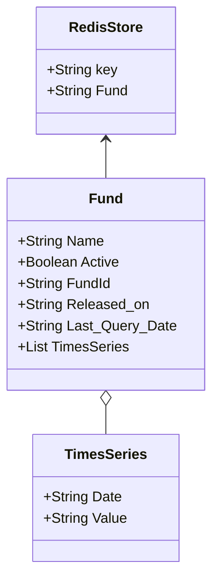

```mermaid
classDiagram  
	class RedisStore 
	RedisStore : +String key 
	RedisStore : +String Fund 

	class Fund
	Fund: +String Name
	Fund: +Boolean Active
	Fund: +String FundId
	Fund: +String Released_on
	Fund: +String Last_Query_Date
	Fund: +List TimesSeries

	class TimesSeries
	TimesSeries: +String Date
	TimesSeries: +String Value

	RedisStore <-- Fund
	Fund o-- TimesSeries


```
